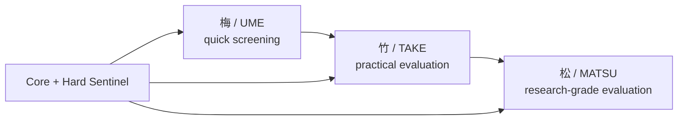
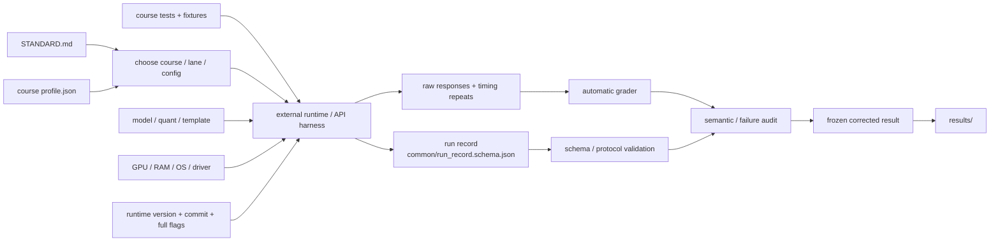
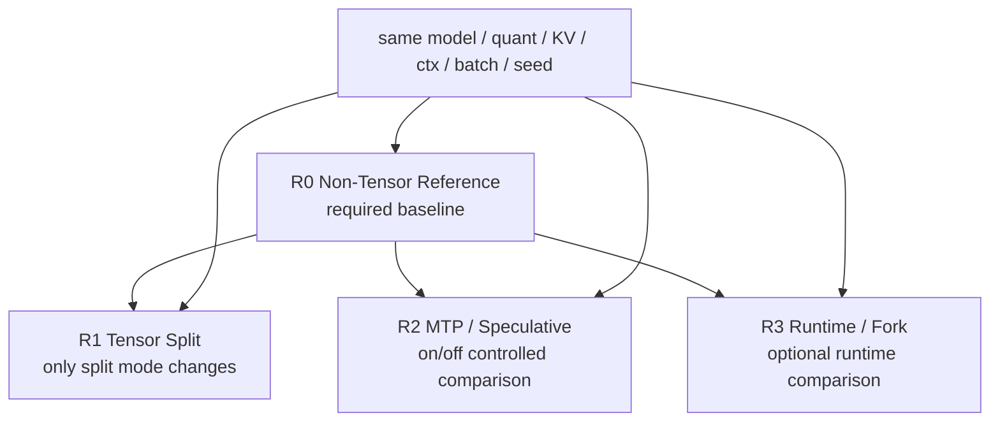
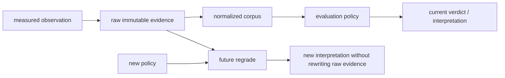

# YLSB repository structure

この文書は **YLSB (Your Local LLM 標準試験「松竹梅」)** の試験仕様・fixture・実測結果・検証ツールの関係を Mermaid で俯瞰するための入口です。

試験ルールの正本は `STANDARD.md` です。ここでは「何を入力し、何を固定し、どこへ結果を残すか」を中心に示します。

## Repository map

```mermaid
flowchart TB
    ROOT["YLSB/"]

    ROOT --> STANDARD["STANDARD.md\n共通試験要項の正典"]
    ROOT --> MANIFEST["manifest.json\nversion / count / SHA-256 / distribution metadata"]

    ROOT --> COURSES["Course packs"]
    COURSES --> UME["ume/\n梅 — screening"]
    COURSES --> TAKE["take/\n竹 — practical selection"]
    COURSES --> MATSU["matsu/\n松 — research/public comparison"]

    ROOT --> COMMON["common/\nshared grader / run schema / legacy challenge"]
    ROOT --> FIX["fixtures/\nfrozen test inputs"]
    ROOT --> SCHEMA["schema/\nstructured-data schemas"]
    ROOT --> REG["registries/\nknown models / runtimes / metadata"]
    ROOT --> POLICY["policies/\nevaluation policy assets"]

    ROOT --> RESULTS["results/\nraw / frozen / normalized corpus / derived audits"]
    ROOT --> TOOLS["tools/\ncorpus construction / grading / validation helpers"]
    ROOT --> TESTS["tests/\nrepository & protocol validation"]
    ROOT --> DOCS["docs/\nverification / methodology / field notes"]
    ROOT --> CI[".github/\nverification automation"]
```

## Course relationship

松竹梅はモデルの格付けではなく、**試験の深さ**です。上位コースは下位の共通基準を保ちながら測定を追加します。

概念的には `梅 ⊂ 竹 ⊂ 松` です。

## One benchmark run

YLSB は特定 runtime の統合 runner そのものではなく、**比較可能な測定を作るための仕様・fixture・grader・記録契約を提供する data pack** です。

## Controlled comparison lanes

高速化の比較では、同じ構成から**一度に一変数だけ**変えます。

## Evidence lifecycle

この分離により、過去の観測値を保存したまま将来の policy で再解釈できます。

## Main paths

| Path | Role |
|---|---|
| `STANDARD.md` | 共通測定ルール・必須記録・failure class の正本 |
| `common/` | 共通 grader と正式 run record schema |
| `ume/`, `take/`, `matsu/` | コース別 profile / tests / templates / helper scripts |
| `fixtures/` | 固定された試験入力 |
| `registries/`, `schema/`, `policies/` | 機械可読メタデータ・契約・評価ルール |
| `results/` | raw / frozen baseline / normalized corpus / derived reports |
| `tools/` | corpus build、検証、採点などの再現用ツール |
| `docs/` | 検証方法・運用知見・補足資料 |
| `manifest.json` | 配布物の version / hash / file inventory |

## Where to start

- **初めて測る**: `README.md` → `STANDARD.md` → 選んだコースの `README.md`
- **正式 run の記録項目**: `common/run_record.schema.json`
- **既存結果を再解析する**: `results/` + `tools/`
- **fixture / policy の整合性を見る**: `fixtures/`, `policies/`, `tests/`, `manifest.json`
- **再現性・証跡を確認する**: `docs/VERIFICATION.md` と GitHub Actions
